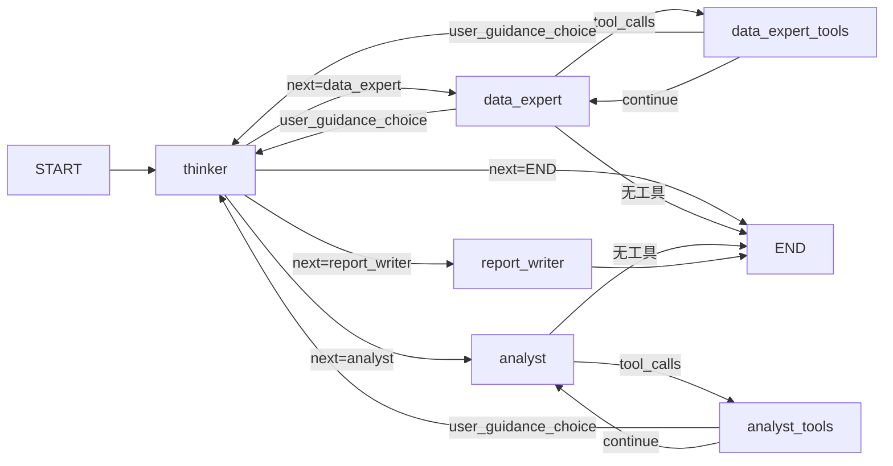
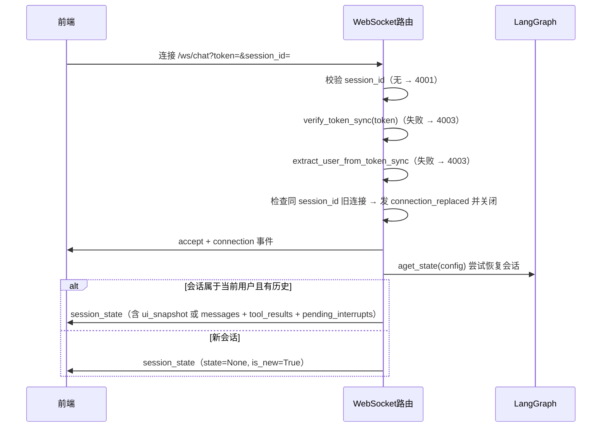
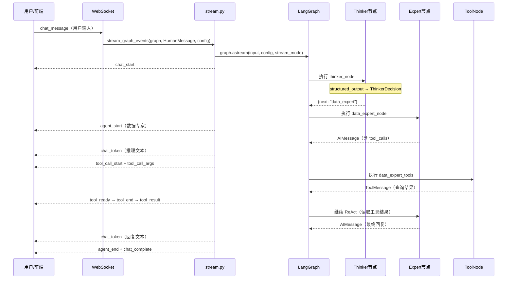

# 铝合金智能设计系统 — Agent 架构完整说明

> 基于 LangChain 1.x + LangGraph 1.x 构建的多 Agent Supervisor Loop 架构

---

## 目录

1. [架构总览](#1-架构总览)
2. [状态设计（AlalloyState）](#2-状态设计alalloystate)
3. [LangGraph 图构建](#3-langgraph-图构建)
4. [中间件体系](#4-中间件体系)
5. [工具设计](#5-工具设计)
6. [MCP 服务使用](#6-mcp-服务使用)
7. [API 与 WebSocket 流程](#7-api-与-websocket-流程)
8. [基于 LangChain/LangGraph 文档的最佳实践对照](#8-基于-langchainlanggraph-文档的最佳实践对照)
9. [当前系统设计存在的问题分析](#9-当前系统设计存在的问题分析)

---

## 1. 架构总览

### 1.1 拓扑与设计原则

- **拓扑**：Supervisor Loop — `用户 → Thinker → Expert → Thinker → Expert → … → END`
- **状态**：最小化设计，继承 `MessagesState`，所有业务数据通过 `messages`（含 `ToolMessage`）传递，不在 State 中平铺业务字段
- **图入口**：`builder.py` 中 `build_graph(checkpointer, mcp_tools)` / 异步版 `build_graph_with_checkpointer`
- **启动链**：`main.py` lifespan：`init_mcp_client()` → `build_graph_with_checkpointer(...)` → `set_graph(compiled_graph)` 注入到 WebSocket 路由

### 1.2 核心文件一览表

| 模块 | 路径 | 职责 |
|------|------|------|
| 图状态 | `app/agents/state.py` | `AlalloyState`（父图）、`ExpertAgentState`（子图） |
| 图构建 | `app/agents/builder.py` | StateGraph 创建、原生子图节点注册、边/路由、compile |
| 节点 | `app/agents/nodes.py` | `thinker_node`、`build_expert_agents`（返回 CompiledGraph） |
| 上下文（legacy） | `app/agents/context.py` | `alalloy_context_builder`（已被 SummarizationMiddleware 取代） |
| 中间件（legacy） | `app/agents/middleware.py` | 已废弃，中间件由 create_agent 内置 HITL/Summarization 处理 |
| HITL payload（legacy）| `app/agents/hitl.py` | 已废弃，HITL 由 HumanInTheLoopMiddleware 处理 |
| 提示词 | `app/agents/prompts/*.md` | thinker / data_expert / analyst / report_writer |
| 工具层 | `app/tools/__init__.py` | DATA_EXPERT_TOOLS、ANALYST_TOOLS 分组 |
| IDME 工具 | `app/tools/idme_tool.py` | `query_idme` |
| 引导挂件 | `app/tools/guidance_tool.py` | `show_guidance_widget` |
| 成分解析 | `app/tools/composition_tool.py` | `parse_composition`（当前未注册到工具列表） |
| MCP 服务 | `app/infra/mcp_service.py` | MCP 客户端初始化、工具分类、描述增强 |
| REST API | `app/api/rest.py` | 健康检查、系统信息、MCP 工具、会话 CRUD |
| 认证 | `app/api/auth.py` | 登录、回调、Token 刷新、登出 |
| WS 路由 | `app/api/websocket/routes.py` | 连接、消息分发、chat/resume、会话恢复 |
| 流式处理 | `app/api/websocket/stream.py` | 图事件 → 前端 WS JSON 事件映射 |
| 连接管理 | `app/api/websocket/manager.py` | session_id → WebSocket 映射 |
| 入口 | `app/main.py` | FastAPI lifespan、路由挂载 |

### 1.3 系统启动与运行时数据流

```mermaid
flowchart TB
    subgraph startup ["应用启动（lifespan）"]
        A["main.py lifespan"] --> B["init_mcp_client()"]
        B --> C["get_postgres_checkpointer_context()"]
        C --> D["build_graph_with_checkpointer(checkpointer, mcp_tools)"]
        D --> E["set_graph(compiled_graph)"]
    end
    subgraph runtime ["运行时（WebSocket）"]
        F["前端 chat_message"] --> G["stream_graph_events()"]
        G --> H["graph.astream(input, config, stream_mode, subgraphs=True)"]
        H --> I["Thinker 路由"]
        I --> J["Expert 原生子图节点（create_agent CompiledGraph）"]
        J --> K["子图内 ReAct 循环 + 中间件（interrupt 自动传播）"]
        K --> L["stream 事件映射为 JSON"]
        L --> M["前端 WebSocket"]
    end
```



---

## 2. 状态设计（AlalloyState）

**文件**：`app/agents/state.py`

- **基类**：`MessagesState`（自动获得 `messages` 字段和 `add_messages` reducer）
- **设计原则**：只存必要的控制字段，业务数据留在 `messages`（`ToolMessage`）中，不平铺 30+ 业务字段

### 状态字段

| 字段 | 类型 | 默认值 | 说明 |
|------|------|--------|------|
| `messages` | `list[BaseMessage]` | `[]` | 对话消息列表（`MessagesState` 内置，含 `add_messages` reducer） |
| `current_agent` | `Optional[str]` | `None` | 当前执行的 Agent 名称（用于前端显示） |
| `next` | `Optional[str]` | `None` | Thinker 路由目标 Agent（`data_expert` / `analyst` / `report_writer` / `END`） |
| `remaining_steps` | `int` | `50` | 剩余 ReAct 步数（防无限循环） |
| `user_guidance_choice` | `Optional[dict]` | `None` | 用户通过 `guidance_widget` 选择的操作（解决跨节点路由问题） |

### 设计要点

- `next` 由 Thinker 填写，条件边读取后路由到对应专家节点
- `user_guidance_choice` 由 `show_guidance_widget` 工具通过 `Command(update=...)` 写入，条件边检测到有值时路由回 Thinker 重新决策，Thinker 读取后将其清空

---

## 3. LangGraph 图构建

**文件**：`app/agents/builder.py`

### 3.1 节点列表

| 节点名 | 实现方式 | 绑定工具 | 中间件 | 说明 |
|--------|----------|----------|--------|------|
| `thinker` | `thinker_node`（`nodes.py`） | 无 | 无 | 结构化输出 `ThinkerDecision`，决定 `next_agent` |
| `data_expert` | 原生子图节点（`create_agent` CompiledGraph） | `query_idme`, `show_guidance_widget` | `SummarizationMiddleware` | LangGraph 自动状态映射 + interrupt 传播 |
| `analyst` | 原生子图节点（`create_agent` CompiledGraph） | `show_guidance_widget` + MCP(ONNX + Calphad) | `HumanInTheLoopMiddleware` + `SummarizationMiddleware` | Calphad 工具走 HITL，interrupt 自动传播 |
| `report_writer` | 原生子图节点（`create_agent` CompiledGraph） | 无 | `SummarizationMiddleware` | 纯文本生成 |

> 父图不再包含 `data_expert_tools`、`analyst_tools` 等 ToolNode 节点。
> 每个专家的 ReAct 循环（LLM ↔ Tool）完全由 create_agent 子图内部完成。

### 3.2 Thinker 路由决策

**文件**：`app/agents/nodes.py`

Thinker 使用 `llm.with_structured_output(ThinkerDecision)` 进行结构化输出路由：

```python
class ThinkerDecision(BaseModel):
    reasoning: str = Field(description="分析用户意图的决策推理过程")
    next_agent: str = Field(description="选择的目标 Agent 名称，可选值: data_expert, analyst, report_writer, END")
```

当检测到 `state["user_guidance_choice"]` 有值时，Thinker 将用户选择注入上下文让 LLM 理解并路由，然后清空该字段防止重复。

### 3.3 专家节点构建（原生子图节点）

**子图构建**：`build_expert_agents(data_expert_tools, analyst_tools, calphad_hitl_tools)` 使用 `create_agent()` 创建三个 CompiledGraph，每个子图：

- `model`: `get_llm()` (DashScope qwen-plus)
- `system_prompt`: `prompts/{agent_name}.md`
- `middleware`: `SummarizationMiddleware` + 可选 `HumanInTheLoopMiddleware`
- `state_schema`: `ExpertAgentState`（AgentState + user_guidance_choice）
- `checkpointer`: `None`（默认，继承父图 checkpointer，支持 interrupt/resume）

**原生注册**：`graph.add_node("data_expert", data_expert_agent)` — 直接传入 CompiledGraph。

LangGraph 自动处理：
1. **状态映射**：通过共享键（`messages`、`user_guidance_choice`）自动在 `AlalloyState` ↔ `ExpertAgentState` 之间映射
2. **interrupt 传播**：子图内的 `interrupt()` 自动传播到父图，由父图 checkpointer 保存中断状态
3. **resume 恢复**：`Command(resume=value)` 自动路由到正确的子图恢复执行
4. **消息去重**：`add_messages` reducer 通过消息 ID 自动处理

### 3.4 边与路由函数

| 起点 | 边类型 | 路由函数 | 目标 |
|------|--------|----------|------|
| `START` | `add_edge` | — | `thinker` |
| `thinker` | `add_conditional_edges` | `_route_after_thinker` | `data_expert` / `analyst` / `report_writer` / `END` |
| `data_expert` | `add_conditional_edges` | `_route_after_expert` | `thinker`（有 user_guidance_choice） / `END` |
| `analyst` | `add_conditional_edges` | `_route_after_expert` | `thinker`（有 user_guidance_choice） / `END` |
| `report_writer` | `add_conditional_edges` | `_route_after_expert` | `thinker`（有 user_guidance_choice） / `END` |

> 不再有 `_route_after_tool_node`、`_should_call_tools` 路由函数 — ReAct 循环在子图内部完成。

### 3.5 路由函数详解

| 函数 | 逻辑 |
|------|------|
| `_route_after_thinker(state)` | 读 `state["next"]`，映射到有效 Agent 或 END；无效值回退 `data_expert` |
| `_route_after_expert(state)` | `user_guidance_choice` 有值 → `"thinker"`（重新路由）；否则 → `END` |

> 原生子图内部的 ReAct 循环（LLM ↔ Tool）完全由 `create_agent` 处理，父图不再需要 `_route_after_tool_node`、`_should_call_tools` 等工具路由。

### 3.6 完整图拓扑



### 3.7 MCP 工具注入

在 `build_graph()` 中：

```
mcp_categorized = categorize_mcp_tools(mcp_tools or [])
onnx_tools    = mcp_categorized["onnx"]       # onnx_model_inference 等
calphad_tools = mcp_categorized["calphad"]     # calphamesh_submit_* 等

data_expert_tools = DATA_EXPERT_TOOLS                         # 仅本地
analyst_tools     = ANALYST_TOOLS + onnx_tools + calphad_tools # 本地 + MCP
```

ToolNode 使用 `handle_tool_errors=_format_tool_error`，工具失败时格式化错误信息作为 ToolMessage 返回给 LLM，让其修正参数重试。

### 3.8 Checkpointer

- 优先使用 `AsyncPostgresSaver`（从 `SUPABASE_DB_URL` 获取连接字符串）
- 连接失败或未配置时降级到 `MemorySaver`（内存存储，不跨重启持久化）
- 全局 checkpointer 引用通过 `set_global_checkpointer()` / `get_global_checkpointer()` 管理

---

## 4. 中间件体系

**文件**：`app/agents/middleware.py`

### 4.1 中间件栈顺序（外→内）

由 `build_middleware_stack(agent_name, hitl_tools, context_builder, tools, hitl_payload_builder)` 构建：

| 顺序 | 中间件 | 钩子 | 作用 |
|------|--------|------|------|
| 1 | `GenericHITLMiddleware` | `wrap_tool_call` | 拦截 `hitl_tools` 中的工具调用，触发 `interrupt()` 等待用户确认/取消/改参 |
| 2 | `GenericContextMiddleware` | `awrap_model_call` | 调用 `context_builder(state, agent_name)` 获取动态上下文追加到 system message |
| 3 | `ModelCallLimitMiddleware` | — | 防止无限循环（thread_limit=100, run_limit=15）；需 LangChain 内置，可选 |
| 4 | `ToolCallLimitMiddleware` | — | 每个工具单轮最多调用 1 次；需 LangChain 内置，可选 |

### 4.2 GenericContextMiddleware

```
class GenericContextMiddleware(AgentMiddleware):
    async def awrap_model_call(self, request, handler):
        context_text = self.context_builder(state, self.agent_name)
        # 追加 context_text 到 system_message 末尾
        modified_request = request.override(system_message=new_system)
        return await handler(modified_request)
```

配套 `alalloy_context_builder`（`context.py`）：从 `messages` 中逆序扫描 ToolMessage，提取 IDME/ONNX/Calphad 结果摘要，各截断 500 字符，最多 5 条。

### 4.3 GenericHITLMiddleware

```
class GenericHITLMiddleware(AgentMiddleware):
    def wrap_tool_call(self, tool_call_request, call_tool):
        if tool_name not in self.hitl_tools:
            return call_tool(tool_call_request)    # 非 HITL 工具直接执行
        payload = self.payload_builder(tool_name, args)
        confirmed = interrupt(payload)             # 暂停图执行
        if confirmed.get("cancelled"):
            return ToolMessage(content="用户已取消")
        if confirmed.get("modified_params"):
            tool_call_request.args.update(...)      # 用户修改参数
        return call_tool(tool_call_request)         # 执行工具
```

配套 `alalloy_hitl_payload_builder`（`hitl.py`）：
- Calphad 三个 submit 工具 → 显示成分 + 温度参数的确认弹窗
- `onnx_model_inference` → 显示模型 UUID + 输入参数的确认弹窗
- 其他工具 → 使用默认 payload

### 4.4 使用现状

> **重要**：中间件栈在 `create_expert_node` 中已构建，但**尚未接入 LLM 调用链**。
> 节点内代码标注了 `# TODO: 集成中间件调用链`，实际仍直接调用 `bound_llm.ainvoke(input_messages)`。
> HITL 功能实际通过工具内部（`show_guidance_widget` 的 `interrupt()`）和 stream.py 的 `__interrupt__` 检测实现。

---

## 5. 工具设计

### 5.1 本地工具

**文件**：`app/tools/__init__.py`

| 工具名 | 文件 | 用途 | 分配角色 |
|--------|------|------|----------|
| `query_idme` | `tools/idme_tool.py` | IDME 材料数据库查询（REST API） | DATA_EXPERT_TOOLS |
| `show_guidance_widget` | `tools/guidance_tool.py` | 引导挂件，暂停图等待用户选择下一步 | DATA_EXPERT_TOOLS, ANALYST_TOOLS |
| `parse_composition` | `tools/composition_tool.py` | 成分字符串解析 | （已定义但未注册到任何工具列表） |

**工具分组**：
```python
DATA_EXPERT_TOOLS = [query_idme, show_guidance_widget]
ANALYST_TOOLS     = [show_guidance_widget]  # MCP 工具在 builder.py 中动态追加
```

### 5.2 query_idme

根据合金体系名称（如 `Al-Si-Mg`）调用 IDME REST API 查询材料属性数据，支持分页。

```python
@tool
def query_idme(material_system: str, page_size: int = 10, page_number: int = 1) -> Dict[str, Any]:
    ...
```

### 5.3 show_guidance_widget（引导挂件与跨节点路由）

**核心机制**：

```
LLM 调用 show_guidance_widget
    → interrupt({"interrupt_type": "guidance_widget", "widget": {...}})
    → 图暂停，前端显示选项挂件
    → 用户选择后前端发送 resume_interrupt
    → Command(resume=user_response)
    → interrupt() 返回 user_response
    → 返回 Command(update={"user_guidance_choice": user_response, "messages": [ToolMessage(...)]})
    → 条件边检测 user_guidance_choice 有值 → 路由回 thinker
    → thinker 读取选择、重新路由
```

支持两种 widget_type：
- `options`：选项卡，让用户选择下一步操作
- `form`：表单，让用户输入/调整参数

### 5.4 MCP 工具

**来源**：`app/infra/mcp_service.py` 通过 `MultiServerMCPClient` 从远程 MCP 服务获取。

| 分类 | 工具名 | 说明 |
|------|--------|------|
| ONNX | `onnx_model_inference` | 执行 ONNX 模型推理预测铝合金性能 |
| ONNX | `onnx_models_list` | 获取所有可用 ONNX 模型列表 |
| ONNX | `onnx_get_model_config` | 查询指定模型的输入参数格式 |
| Calphad | `calphamesh_submit_point_task` | 提交单点平衡计算任务 |
| Calphad | `calphamesh_submit_line_task` | 提交线性扫描计算任务 |
| Calphad | `calphamesh_submit_scheil_task` | 提交 Scheil 凝固模拟任务 |
| Calphad | `calphamesh_get_task_status` | 查询任务状态和结果 |
| Calphad | `calphamesh_list_tasks` | 列出任务历史 |

### 5.5 MCP 工具的 HITL 配置

在 `builder.py` 中，`analyst` 节点配置了需要 HITL 确认的工具：

```python
hitl_tools={"calphamesh_submit_scheil_task", "calphamesh_submit_point_task", "calphamesh_submit_line_task"}
```

### 5.6 弹性工具节点（ResilientToolNode）

**文件**：`app/agents/tool_node_wrapper.py`

包装 `ToolNode` 添加：
- 超时保护（默认 60 秒）
- 指数退避重试（默认最多 2 次）
- 错误恢复（返回错误 ToolMessage 让 LLM 继续）

> **当前状态**：已实现但未接入图，图中仍使用标准 `ToolNode`。

---

## 6. MCP 服务使用

**文件**：`app/infra/mcp_service.py`

### 6.1 初始化与生命周期

```
main.py lifespan 启动:
    mcp_tools = await init_mcp_client()    # 连接 MCP_URL，获取工具
    compiled_graph = build_graph(..., mcp_tools=mcp_tools)  # 注入到图

main.py lifespan 关闭:
    await cleanup_mcp_client()             # 清理资源
```

### 6.2 初始化细节

- **连接**：`MultiServerMCPClient(mcp_config, tool_interceptors=[_log_tool_call])`
- **过滤**：`ALLOWED_TOOLS` 白名单（8 个工具）
- **增强**：`TOOL_DESCRIPTIONS` 替换 MCP 原生描述为更详细的中文描述（含参数格式、注意事项等）
- **拦截器**：`_log_tool_call` 记录每次工具调用的名称、参数、耗时

### 6.3 工具分类

`categorize_mcp_tools(mcp_tools)` 按角色分组：

```python
ONNX_TOOL_NAMES = {"onnx_model_inference", "onnx_models_list", "onnx_get_model_config"}
CALPHAD_TOOL_NAMES = {"calphamesh_submit_point_task", "calphamesh_submit_line_task",
                      "calphamesh_submit_scheil_task", "calphamesh_get_task_status",
                      "calphamesh_list_tasks"}
```

返回 `{"onnx": [...], "calphad": [...]}`，在 `builder.py` 中注入到 `analyst_tools`。

### 6.4 在 REST API 中的暴露

| 端点 | 说明 |
|------|------|
| `GET /api/mcp/tools` | 列出已加载的 MCP 工具及其参数 schema |
| `POST /api/mcp/test/{tool_name}` | 测试调用指定 MCP 工具（调试用） |

---

## 7. API 与 WebSocket 流程

### 7.1 REST API 端点

| 方法 | 路径 | 说明 | 认证 |
|------|------|------|------|
| GET | `/api/health` | 健康检查 | 否 |
| GET | `/api/info` | 系统信息（名称、版本、架构、agents） | 否 |
| GET | `/api/mcp/tools` | MCP 工具列表 | 否 |
| POST | `/api/mcp/test/{tool_name}` | 测试 MCP 工具 | 否 |
| POST | `/api/sessions` | 创建会话 | 是 |
| GET | `/api/sessions` | 用户会话列表 | 是 |
| GET | `/api/sessions/{session_id}` | 获取会话 | 是 |
| PATCH | `/api/sessions/{session_id}` | 更新会话 | 是 |
| DELETE | `/api/sessions/{session_id}` | 删除会话 | 是 |
| GET | `/api/auth/login` | 登录（DEV 直接发 JWT，否则重定向 OIDC） | 否 |
| GET | `/api/auth/callback` | OIDC 回调 | 否 |
| GET | `/api/auth/me` | 当前用户信息 | 是 |
| POST | `/api/auth/refresh` | 刷新 Token | 是 |
| POST | `/api/auth/logout` | 登出 | 是 |

### 7.2 WebSocket 连接与鉴权

**端点**：`/ws/chat?token=xxx&session_id=xxx`

**连接流程**：



**配置**：`config = {"configurable": {"thread_id": session_id}}`

### 7.3 消息类型（前端 → 后端）

| type | 说明 | 后端处理 |
|------|------|----------|
| `chat_message` / `chat` | 用户输入 | 构造 `HumanMessage` → `stream_graph_events(graph, input_data, config)` |
| `resume_interrupt` / `resume` | HITL 恢复 | 构造 `Command(resume=value)` → `stream_graph_events(graph, resume_cmd, config)` |
| `ping` | 心跳 | 回 `pong` |
| `stop_generate` | 停止生成 | 回 `generate_stopped` |
| `save_ui_snapshot` | 保存 UI 快照 | 写入 `sessions.metadata.ui_snapshot`，回 `ui_snapshot_saved` |

### 7.4 流式事件（后端 → 前端）

**文件**：`app/api/websocket/stream.py`

使用 `graph.astream(input_data, config, stream_mode=["messages", "updates"])` 双通道模式。

#### messages 通道（LLM token 流式 + tool_call_chunks）

| 条件 | 发送事件 | 说明 |
|------|----------|------|
| `chunk.content` 有文本 | `chat_token` | 流式文本（前端默认为 pending，后续决定类型） |
| `tool_call_chunks` 有 name | `tool_call_start` | 检测到工具调用开始 |
| `tool_call_chunks` 有 args | `tool_call_args` | 工具参数片段（实时显示构建过程） |
| 节点为 `thinker` | 跳过 | structured_output 不参与流式显示 |

#### updates 通道（状态变化信号）

| 条件 | 发送事件 | 说明 |
|------|----------|------|
| 节点切换（非 thinker/ToolNode） | `agent_start` / `agent_end` | 节点开始/结束 |
| `__interrupt__` 含 `guidance_widget` | `interrupt`（type=guidance_widget） | 引导挂件 |
| `__interrupt__` 含 `confirm_tool_execution` | `interrupt`（type=confirm_tool） | HITL 工具确认 |
| ToolMessage | `tool_end` + `tool_result` | 工具执行结果 |
| AIMessage.tool_calls | `tool_ready` | 工具参数完整确认 |

#### 流结束事件

| 事件 | 条件 |
|------|------|
| `chat_complete` | 正常结束 |
| `interrupt` | 图因 interrupt 暂停（先发 interrupt，不发 chat_complete） |
| `session_title_updated` | 首次对话后自动生成会话标题 |

#### Agent 显示名映射

| 节点名 | 前端显示 |
|--------|----------|
| `thinker` | 思维规划 |
| `data_expert` | 数据专家 |
| `analyst` | 分析专家 |
| `report_writer` | 报告撰写 |

### 7.5 会话恢复

**`_restore_session_state(graph, config, session_id)`** 逻辑：

1. 从 Checkpointer 获取图状态
2. 优先使用 `metadata.ui_snapshot`（前端保存的完整 UI 状态）
3. 否则序列化 messages（最多 50 条）+ 提取 `tool_results`（ONNX/Calphad/IDME）+ 提取 `pending_interrupts`
4. `_fix_message_chain_if_needed`：若最后一条 AIMessage 有 tool_calls 但缺少对应 ToolMessage，则补充占位 ToolMessage

### 7.6 完整消息流序列图



---

## 8. 基于 LangChain/LangGraph 文档的最佳实践对照

以下依据本地文档 `langchain-docs/src/oss/` 中 create_agent、多 Agent、中间件、interrupt、stream 相关页面整理。

### 8.1 create_agent 与 Agent 构建

- **官方推荐**：LangChain v1 以 `create_agent(model, tools, middleware=[...])` 为标准构建方式，替代已弃用的 `langgraph.prebuilt.create_react_agent`
- **底层**：`create_agent` 基于 LangGraph 图实现，自动获得 checkpoint、streaming、HITL、time travel 等能力
- **中间件是扩展点**：通过 `middleware` 列表注入，支持 `before_agent` / `before_model` / `wrap_model_call` / `wrap_tool_call` / `after_model` / `after_agent` 钩子

### 8.2 多 Agent 设计（Router / Handoffs）

- **Router**：用路由节点 + `Command(goto=...)` 或 `Send` 将请求分发给不同专家；适合垂直领域清晰、需并行或单选专家的场景
- **Handoffs**：通过工具更新状态（如 `current_step` / `active_agent`），工具返回 `Command(update={...})` 实现步骤或 Agent 切换；适合多阶段对话、状态驱动流程
- **当前系统**：Thinker 做路由 + 条件边属于 Router 思路；`show_guidance_widget` 通过工具内 `interrupt` + `Command(update=user_guidance_choice)` 再路由回 Thinker，符合 Handoffs 中「工具驱动状态与路由」的模式

### 8.3 上下文与总结类中间件

- **SummarizationMiddleware**：当 token/消息数达到 trigger 时自动总结历史，保留 keep 条最近消息；用于长对话、超上下文场景
- **自定义上下文**：在 `wrap_model_call` 中通过 `request.override(system_message=...)` 或 `request.system_message.content_blocks` 追加内容
- **执行顺序**：`before_*` 正序、`after_*` 逆序、`wrap_*` 嵌套（最先加入的包在最外）

### 8.4 HITL 中间件与 interrupt

- **HumanInTheLoopMiddleware**：配置 `interrupt_on={"tool_name": True | {"allowed_decisions": ["approve","edit","reject"]}}`，在工具执行前由中间件触发 interrupt
- **interrupt()**：LangGraph 底层 API，在节点或工具内调用 `interrupt(payload)` 暂停执行，payload 通过 `__interrupt__` 返回给调用方；恢复时用同一 thread_id 再次 invoke，传入 `Command(resume=value)`
- **要点**：HITL 需 checkpoint 持久化；resume 需相同 thread_id；payload 需 JSON 可序列化

### 8.5 流式（Stream）

- **推荐模式**：`stream_mode=["messages", "updates"]` 同时获取 LLM token 流（messages）和状态/节点更新（updates）
- **messages 通道**：产出 (chunk, metadata) 元组，chunk 为 AIMessageChunk
- **updates 通道**：按节点产出状态增量；含 `__interrupt__` 时表示图已暂停

---

## 9. 当前系统设计存在的问题分析

结合官方文档规范与现有实现，对比如下。

### 9.1 未使用 create_agent，中间件未接入调用链

| 维度 | 文档建议 | 当前实现 | 问题 |
|------|----------|----------|------|
| Agent 构建 | `create_agent(model, tools, middleware=[...])` | 手写 StateGraph + 自实现 `create_expert_node`，直接 `bound_llm.ainvoke(...)` | 中间件未生效 |
| 中间件 | 通过钩子自动参与模型/工具调用 | `build_middleware_stack` 已构建，但节点内标注 TODO，未执行 | 上下文注入、HITL、限流均未生效 |

**建议**：若沿用当前图拓扑（Thinker + 多专家），至少将专家节点内「准备 messages → 调用 LLM」改为经过统一的 middleware 链；或评估将每个专家改为 `create_agent` 生成的子图再嵌入当前图。

### 9.2 HITL 未走官方中间件

| 维度 | 文档建议 | 当前实现 | 问题 |
|------|----------|----------|------|
| HITL | `HumanInTheLoopMiddleware` + `interrupt_on` | 工具/ToolNode 内部直接调用 `interrupt()` | 无法统一配置管理 approve/edit/reject |
| 管理 | 中间件统一拦截 | `GenericHITLMiddleware` 已实现但未接入 | 前端需区分多种 interrupt 类型 |

**注意**：HITL 工具（如 Calphad 确认）和用户交互工具（如 `show_guidance_widget`）本质不同 —— HITL 只在当前 Agent 中处理不涉及路由，而用户交互可能导致图流转。这两种场景需要不同的 interrupt 处理策略。

**建议**：将纯 HITL 确认统一经 middleware intercept；保留 `show_guidance_widget` 的 `Command(update=...)` 模式用于跨节点路由。

### 9.3 上下文注入未生效

| 维度 | 文档建议 | 当前实现 | 问题 |
|------|----------|----------|------|
| 注入方式 | `wrap_model_call` 中修改 `system_message` | `GenericContextMiddleware` 已实现，但未被专家节点调用 | 动态上下文未注入 |
| 影响 | — | 节点直接拼接 `[SystemMessage(prompt)] + messages` | 模型拿不到已有 IDME/ONNX/Calphad 摘要 |

**建议**：在专家节点中，在调用 LLM 前执行 context 中间件（或等价的上下文拼接），确保每次模型调用都带上 `alalloy_context_builder` 的产出。

### 9.4 流式与 interrupt 处理（符合文档）

| 维度 | 文档建议 | 当前实现 | 结论 |
|------|----------|----------|------|
| 流式 | `stream_mode=["messages", "updates"]` | `stream.py` 使用双通道 | 一致 |
| interrupt | 在 updates 中检测 `__interrupt__` | 已实现 | 一致 |
| resume | `Command(resume=...)` + 相同 thread_id | WebSocket 用 session_id 作 thread_id | 一致 |

### 9.5 多 Agent 路由与 Handoffs 设计（合理）

| 维度 | 文档建议 | 当前实现 | 结论 |
|------|----------|----------|------|
| Router | 分类后 `Command(goto=...)` | Thinker + 条件边 | 符合 |
| Handoffs | 工具通过 `Command(update=...)` 更新状态 | `show_guidance_widget` 更新 `user_guidance_choice` | 符合 |

### 9.6 其它可改进点

| 问题 | 说明 | 建议 |
|------|------|------|
| 缺少历史总结 | 长对话仅靠 `remaining_steps` 和截断，易触及上下文上限 | 引入 `SummarizationMiddleware` 或等价策略 |
| ResilientToolNode 未接入 | 已实现超时/重试但图中仍用标准 ToolNode | 接入图或改用 `ToolRetryMiddleware` |
| parse_composition 未注册 | 工具已定义但未加入任何工具列表 | 评估是否需要注册到 DATA_EXPERT_TOOLS 或 ANALYST_TOOLS |

---

## 附录：关键代码引用

### 图构建入口

```python
# app/agents/builder.py, build_graph()
graph = StateGraph(AlalloyState)
graph.add_node("thinker", thinker_node)
graph.add_node("data_expert", data_expert_node)
graph.add_node("data_expert_tools", ToolNode(data_expert_tools, handle_tool_errors=_format_tool_error))
graph.add_node("analyst", analyst_node)
graph.add_node("analyst_tools", ToolNode(analyst_tools, handle_tool_errors=_format_tool_error))
graph.add_node("report_writer", report_writer_node)
graph.add_edge(START, "thinker")
# ... conditional edges ...
compiled = graph.compile(checkpointer=checkpointer)
```

### 流式事件处理

```python
# app/api/websocket/stream.py, stream_graph_events()
async for event in graph.astream(input_data, config, stream_mode=["messages", "updates"]):
    channel, data = event
    if channel == "messages":
        # AIMessageChunk → chat_token / tool_call_start / tool_call_args
    elif channel == "updates":
        # __interrupt__ → interrupt 事件
        # ToolMessage → tool_end + tool_result
```

### 引导挂件跨节点路由

```python
# app/tools/guidance_tool.py, show_guidance_widget()
user_response = interrupt({"interrupt_type": "guidance_widget", "widget": widget_payload})
return Command(update={
    "user_guidance_choice": user_response,
    "messages": [ToolMessage(content=f"用户选择了：{choice_label}", tool_call_id=tool_call_id)]
})
```
