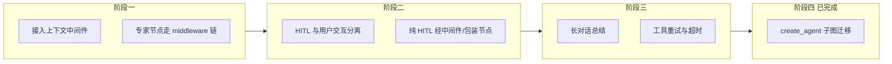

# 铝合金 Agent 架构重构详细方案

> 基于 [ARCHITECTURE.md](./ARCHITECTURE.md) 与计划文档中「当前系统设计存在的问题分析」制定的分阶段重构方案。

---

## 一、问题与目标汇总

### 1.1 待解决问题清单

| 编号 | 问题 | 影响 | 优先级 |
|------|------|------|--------|
| P1 | 中间件未接入调用链（Context/HITL/限流未生效） | 动态上下文未注入，HITL 无法统一配置，限流未生效 | 高 |
| P2 | 上下文注入未执行 | 模型拿不到已有 IDME/ONNX/Calphad 摘要，多轮与跨节点推理质量下降 | 高 |
| P3 | HITL 与用户交互工具混同 | 纯确认类 HITL（不涉及路由）与引导挂件（会触发图流转）共用 interrupt，难以统一配置与前端区分 | 高 |
| P4 | 长对话无历史总结 | 易触及上下文上限，仅靠 remaining_steps 与截断 | 中 |
| P5 | 工具层无统一重试/超时 | ResilientToolNode 已实现未接入，MCP 调用易超时无保障 | 中 |
| P6 | ~~未使用 create_agent~~ **已解决** | 已迁移到 create_agent + HumanInTheLoopMiddleware + SummarizationMiddleware | ~~低~~ 完成 |

### 1.2 设计约束与保留

- **保留**：当前 Supervisor 拓扑（Thinker → data_expert / analyst / report_writer）与条件边路由。
- **保留**：`show_guidance_widget` 的「工具内 interrupt + Command(update=user_guidance_choice)」实现，用于跨节点回 Thinker。
- **区分**：**纯 HITL**（仅当前 Agent 内确认/取消/改参，不改变图流转）与 **用户交互工具**（可能改变图流转），采用不同实现路径。

---

## 二、重构阶段总览



| 阶段 | 目标 | 预估改动量 |
|------|------|------------|
| 阶段一 | 上下文中间件接入专家节点，模型调用前注入动态上下文 | 小（仅 nodes.py + 少量适配） |
| 阶段二 | 纯 HITL 统一经中间件或 HITL 包装节点，与 guidance_widget 分离 | 中（builder + 新节点或自定义 ToolNode） |
| 阶段三 | 长对话总结 + 工具重试/超时 | 小～中 |
| 阶段四 | **已完成**：create_agent 子图迁移 | 大 |

---

## 三、阶段一：接入上下文中间件

### 3.1 目标

- 专家节点在**每次调用 LLM 前**执行上下文中间件逻辑，将 `alalloy_context_builder(state, agent_name)` 的产出追加到 system message。
- 不改变图拓扑，不依赖 LangChain 的 `ModelRequest`/`handler` 链（因当前未使用 create_agent），采用「显式调用 context_builder + 拼接 system message」的最小实现。

### 3.2 方案 A（推荐）：专家节点内显式注入

**思路**：在 `create_expert_node` 的 `expert_node` 内，构造 `input_messages` 时先计算上下文，再拼接到 system message，无需依赖 `ModelRequest`。

**修改文件**：`app/agents/nodes.py`

**具体改动**：

1. 在 `expert_node` 中，构建 `input_messages` 之前：
   - 调用 `context_text = alalloy_context_builder(state, agent_name)`（或通过已构建的 middleware 列表里只取 Context 中间件执行）。
2. 若有 `context_text`，则：
   - `system_content = system_prompt + "\n\n" + context_text`
   - `input_messages = [SystemMessage(content=system_content)] + list(messages)`
3. 若无，则保持现状：`input_messages = [SystemMessage(content=system_prompt)] + list(messages)`。

**伪代码**：

```python
# 在 expert_node 内，替换原来的 input_messages 构造
messages = state.get("messages", [])
context_text = alalloy_context_builder(dict(state), agent_name)
system_content = system_prompt + ("\n\n" + context_text if context_text else "")
input_messages = [SystemMessage(content=system_content)] + list(messages)
# 后续 bound_llm.ainvoke(input_messages) 不变
```

**验收**：专家节点多轮对话或跨节点后，同一会话中已有的 IDME/ONNX/Calphad 结果摘要应出现在当次模型请求的 system 中（可通过日志或临时打印 system_content 验证）。

### 3.3 方案 B（可选）：通用 middleware 执行器

**思路**：在节点内构造一个类似 `ModelRequest` 的简易对象（含 `state`、`system_message`、`messages`），按顺序执行 `build_middleware_stack` 返回的、实现了 `awrap_model_call` 的中间件，最后用中间件链输出后的 system_message + messages 调用 LLM。

**优点**：与官方 middleware 概念一致，后续若接入 HITL 的 wrap_tool_call 也便于统一。  
**缺点**：需适配 `ModelRequest`/`handler` 的签名（当前 LangChain 的 `ModelRequest` 可能含 `state`、`runtime` 等），工作量略大。

**建议**：阶段一优先采用方案 A，快速让上下文注入生效；若阶段二引入统一中间件链再考虑替换为方案 B。

### 3.4 依赖与风险

- 无新增依赖。
- `context_builder` 若依赖的 `state` 字段在并发下被修改，需保证只读或拷贝；当前 `state` 为图状态快照，一般安全。

---

## 四、阶段二：HITL 与用户交互工具分离

### 4.1 概念区分

| 类型 | 代表 | 行为 | 是否改变图流转 |
|------|------|------|----------------|
| **纯 HITL** | Calphad 三个 submit、ONNX 推理确认 | 工具执行前暂停，用户 approve/edit/reject，仅影响本次工具调用 | 否 |
| **用户交互工具** | show_guidance_widget | 工具内 interrupt，用户选择后通过 Command(update=user_guidance_choice) 写状态，条件边回 thinker | 是 |

目标：纯 HITL 统一由「中间件或专用节点」在工具执行前 intercept；用户交互工具保持「工具内 interrupt + Command(update=...)」不改。

### 4.2 方案 A：HITL 包装节点 + 原 ToolNode

**思路**：在 `analyst` 与 `analyst_tools` 之间插入节点 `analyst_hitl`；在 `data_expert` 与 `data_expert_tools` 之间不插入（data_expert 无 HITL 工具列表）。

- **analyst** → 有 tool_calls 时 → 先到 **analyst_hitl**。
- **analyst_hitl**：
  - 读取 `state["messages"][-1]` 的 `tool_calls`；
  - 对每个 tool_call，若 `tool_name in hitl_tools`，则 `interrupt(alalloy_hitl_payload_builder(tool_name, args))`，根据 resume 结果决定是取消（写 ToolMessage 取消）还是放行；
  - 若全部放行或无 HITL 工具，则转发到原 `analyst_tools` 的输入（即 state 不变，或仅追加「用户已确认」的 ToolMessage 占位，由下一节点执行实际工具）。
- **analyst_hitl** 输出后 → 进入 **analyst_tools** 执行工具。

**难点**：LangGraph 中「中间节点」不能直接调用 ToolNode 的逻辑，需要把「已确认的 tool_calls」交给下一个节点执行。因此更稳妥的做法是：HITL 节点只做「拦截 + interrupt + 写回 resume 结果到 state」，然后边指向 `analyst_tools`；ToolNode 执行时看到 state 里已有「用户确认」标记或已追加的 ToolMessage，不再二次 interrupt。这样需要 ToolNode 能区分「已确认」与「未确认」，或在 HITL 节点里对需确认的工具先 interrupt，resume 后把「确认后的 args」写回 state，ToolNode 从 state 读「确认后参数」执行。实现复杂度较高。

### 4.3 方案 B（推荐）：自定义 HITL ToolNode 包装器

**思路**：保留现有图结构，将 `analyst_tools` 从 `ToolNode(tools)` 改为 **HITL 包装的 ToolNode**：

- 新建 `app/agents/hitl_tool_node.py`（或放在 `tool_node_wrapper.py`）：
  - 类 `HITLAwareToolNode` 接收 `tools`、`hitl_tools: Set[str]`、`payload_builder`、`handle_tool_errors`。
  - 对 state 中 last message 的每个 tool_call：
    - 若 `tool_name in hitl_tools`：先 `payload = payload_builder(tool_name, args)`，再 `resume_value = interrupt(payload)`；若用户取消则追加 ToolMessage(content=取消信息)；若用户改参则用新 args 调用工具；若批准则用原 args 调用工具。
    - 若不在 hitl_tools：直接调用原 ToolNode 逻辑（或委托给内置 ToolNode）。
  - 其他工具（如 `show_guidance_widget`）不在此列表，仍由工具内部自己 `interrupt`，无需经过 HITL 包装。
- 在 `builder.py` 中：
  - `data_expert_tools` 仍为 `ToolNode(data_expert_tools, ...)`（无 HITL 列表）。
  - `analyst_tools` 改为 `HITLAwareToolNode(analyst_tools, hitl_tools={...}, payload_builder=alalloy_hitl_payload_builder, ...)`。

**优点**：图拓扑不变，仅替换 analyst 的 ToolNode 实现；纯 HITL 与 guidance_widget 自然分离（guidance 不在 hitl_tools 中）。  
**缺点**：需实现并测试 HITLAwareToolNode，保证与现有 stream/interrupt 事件兼容。

### 4.4 方案 C：在 MCP/工具层为 Calphad 包一层「确认后再调」

**思路**：不改图，为需要 HITL 的 MCP 工具再包一层 LangChain Tool：外层 tool 内先 `interrupt(payload)`，resume 后再调用真实 MCP 工具。这样图仍用标准 ToolNode，HITL 逻辑在「工具实现」里。

**缺点**：与「HITL 与用户交互分离」的初衷略背道而驰，且每个需 HITL 的工具都要包一层，维护成本高。仅作备选。

### 4.5 阶段二推荐结论

- **采用方案 B**：实现 `HITLAwareToolNode`，仅对 analyst 的 ToolNode 替换；`hitl_tools` 仅包含三个 Calphad submit（及可选 onnx_model_inference），不包含 `show_guidance_widget`。
- **前端**：继续区分 `interrupt_type: "confirm_tool"` 与 `"guidance_widget"`，无需大改；若后续统一为同一 UI 组件，仅需根据 type 切换展示与提交格式。

### 4.6 实现要点（方案 B）

1. **HITLAwareToolNode 接口**：与 LangGraph `ToolNode` 一致，`ainvoke(state, config)`，返回 `{"messages": [ToolMessage, ...]}`。
2. **interrupt payload**：复用 `alalloy_hitl_payload_builder`，保证与现有前端 confirm 弹窗兼容。
3. **resume 值**：与现有 `hitl.py` 约定一致（如 `cancelled`、`modified_params`），取消时写 ToolMessage 表示用户取消；改参时用 `modified_params` 覆盖 args 再调用工具。
4. **stream**：interrupt 仍通过 LangGraph 的 `__interrupt__` 发出，`stream.py` 无需改；resume 仍为 `Command(resume=value)`。

---

## 五、阶段三：长对话总结与工具弹性

### 5.1 长对话总结

**目标**：当 messages 或预估 token 数超过阈值时，对较早的消息进行总结或截断，保留最近 N 条 + 一条总结，避免超出模型上下文。

**方案**：

- **选项 1**：在专家节点内，调用 LLM 前增加一步「消息修剪」：
  - 若 `len(messages) > 阈值`（如 30）或预估 token > 某值，则调用一次「总结用」的 LLM（或本地 summarization 函数），将 `messages[0:-keep]` 总结成一条 SystemMessage 或 HumanMessage，再与 `messages[-keep:]` 组成新 messages。
- **选项 2**：若后续引入 `create_agent`，直接使用官方 `SummarizationMiddleware`（trigger/keep 配置）。

**建议**：阶段三先实现「专家节点内可选的消息修剪/总结」（可配置开关与阈值），与现有 `remaining_steps` 配合；不强制依赖 LangChain 的 SummarizationMiddleware。

### 5.2 工具重试与超时

**目标**：MCP 或远程工具调用易超时或临时失败，需要统一重试与超时。

**方案**：

- **选项 1**：接入现有 `ResilientToolNode`，将 `data_expert_tools` / `analyst_tools` 改为 `ResilientToolNode(tools, timeout=60, max_retries=2)`，内部再调用 `ToolNode`（及阶段二的 HITLAwareToolNode 若已实现）。需注意 HITL 与 ResilientToolNode 的顺序：先 HITL 再执行，执行层再做重试。
- **选项 2**：在 MCP 的 `tool_interceptors` 中增加 retry + 超时（如 `asyncio.timeout` + 指数退避），与文档「Tool interceptors」一致，工具层不改图节点。

**建议**：优先在 MCP `tool_interceptors` 中加 retry+timeout，影响面小；若仍需节点级超时（如整轮 ReAct 超时），再考虑接入 ResilientToolNode。

---

## 六、阶段四（已完成）：create_agent 子图迁移

> **状态：已实施。** 详见 `builder.py`、`nodes.py`、`state.py`、`stream.py` 改动。

### 6.1 实施概要

- **架构**：父图保留 Thinker + 条件路由，每个专家由 `create_agent()` 生成子图，包装节点负责父/子状态映射。
- **State**：新增 `ExpertAgentState(AgentState)` 扩展 `user_guidance_choice`；父图 `AlalloyState` 不变。子图通过 `state_schema=ExpertAgentState` 支持 `show_guidance_widget` 的 `Command(update=user_guidance_choice)`。
- **中间件**：`SummarizationMiddleware(trigger=("tokens",4000), keep=("messages",20))` 全专家启用；`HumanInTheLoopMiddleware(interrupt_on={Calphad 三工具})` 仅 analyst。
- **HITL/interrupt**：子图 `checkpointer=None` 继承父图 checkpointer，interrupt/resume 正常工作。
- **流式**：`astream(..., subgraphs=True)` 以输出子图内部 LLM token、工具调用事件。stream.py 处理三元组 `(namespace, channel, data)` 格式。
- **清理**：父图不再包含 `data_expert_tools`/`analyst_tools` 节点；`_route_after_tool_node`、`_should_call_tools` 已移除；`middleware.py`、`hitl.py` 降为 legacy。

---

## 七、实施顺序与检查点

| 顺序 | 内容 | 产出 | 验收 |
|------|------|------|------|
| 1 | 阶段一：专家节点内显式调用 context_builder，拼接 system message | nodes.py 修改 | 多轮/跨节点后 model 请求中含历史工具结果摘要 |
| 2 | 阶段二：实现 HITLAwareToolNode，analyst_tools 替换为该节点，hitl_tools 仅含 Calphad 三工具 | hitl_tool_node.py（或 tool_node_wrapper 扩展）+ builder.py | Calphad 提交前出现 confirm interrupt，确认后正常执行；show_guidance_widget 仍为 guidance_widget interrupt |
| 3 | 阶段三：专家节点可选消息修剪/总结 | nodes.py 或新 util | 超长对话时 system 或 messages 被总结/截断 |
| 4 | 阶段三：MCP tool_interceptors 增加 retry+timeout | mcp_service.py | MCP 工具临时失败时自动重试，超时可控 |
| 5 | 阶段四（已完成）：create_agent 子图迁移 — 全专家使用 create_agent + 包装节点 | builder/nodes/state/stream.py 改动 | 图构建成功、节点拓扑正确 |

---

## 八、风险与回退

- **阶段一**：改动小，回退仅恢复 `expert_node` 内对 `context_builder` 的调用即可。
- **阶段二**：若 HITLAwareToolNode 与现有 stream/resume 不兼容，可暂回退为原 ToolNode，保留当前「工具内 interrupt」的 Calphad 实现，仅文档说明与官方 HITL 的差异。
- **阶段三**：总结逻辑若影响对话质量，可通过配置关闭或调大阈值。

---

## 九、文档与配置

- 重构完成后更新 **ARCHITECTURE.md**：补充「上下文注入实际执行路径」「HITL 与用户交互工具分离设计」「长对话总结策略」「工具重试/超时」。
- 若引入新配置项（如总结阈值、是否启用 HITL 包装、MCP 重试次数），在 `.env.example` 或配置模块中说明默认值与含义。
