# Alalloy Agent — 多登录方案设计文档

> **版本**: v1.0  
> **日期**: 2026-03-06  
> **状态**: 待评审  
> **作者**: TopMaterial Tech 研发团队

---

## 目录

1. [背景与目标](#1-背景与目标)
2. [三套登录模式概览](#2-三套登录模式概览)
3. [整体架构图](#3-整体架构图)
4. [登录流程详解](#4-登录流程详解)
   - 4.1 [DEV_MODE 测试登录流程](#41-devmode-测试登录流程)
   - 4.2 [FerrisKey OIDC 登录流程](#42-ferriskey-oidc-登录流程)
   - 4.3 [Supabase 邮箱密码登录流程](#43-supabase-邮箱密码登录流程)
5. [前端入口控制设计](#5-前端入口控制设计)
6. [Token 统一验证链设计](#6-token-统一验证链设计)
7. [用户信息统一模型](#7-用户信息统一模型)
8. [Token 刷新与登出策略](#8-token-刷新与登出策略)
9. [环境变量配置规范](#9-环境变量配置规范)
10. [文件变更清单](#10-文件变更清单)
11. [数据库影响分析](#11-数据库影响分析)
12. [安全注意事项](#12-安全注意事项)
13. [实施计划](#13-实施计划)

---

## 1. 背景与目标

### 1.1 现状

当前 Alalloy Agent 拥有两套登录机制：

| 现有机制 | 说明 |
|---|---|
| **DEV_MODE 测试登录** | `DEV_MODE=true` 时跳过所有 IAM 认证，后端直接签发本地 HS256 测试 Token |
| **FerrisKey OIDC 登录** | 生产模式，通过公司自建 IAM（FerrisKey/TopMat Trust）完成 OIDC 授权码流程 |

### 1.2 新增需求

| 需求 | 说明 |
|---|---|
| **新增 Supabase 邮箱/密码登录** | 用于向甲方公司交付时提供独立账号体系，不依赖公司内部 IAM |
| **保留 FerrisKey 登录** | 公司内部中台统一管理，继续使用 |
| **保留 DEV_MODE** | 开发测试环境继续使用 |
| **前端入口可配置** | 通过环境变量控制登录页面显示哪些入口（两个都显示、或只显示其中一个） |

### 1.3 设计原则

- **不替换，只叠加**：新增 Supabase 登录，不影响现有 FerrisKey 和 DEV_MODE
- **后端统一鉴权**：所有受保护接口的鉴权逻辑不变，只扩展 Token 验证链
- **前端统一状态**：无论哪种登录，`authStore` 管理同一套状态字段
- **数据天然隔离**：不同登录来源的用户 `sub` 由各自系统生成，不会冲突

---

## 2. 三套登录模式概览

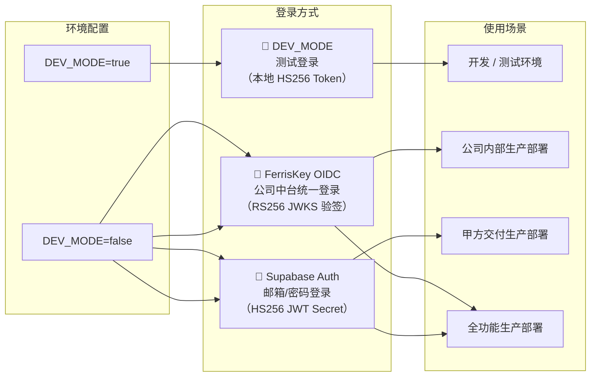

| 模式 | 激活条件 | JWT 签发方 | 验签方式 | 典型用户 |
|---|---|---|---|---|
| **DEV_MODE** | `DEV_MODE=true` | 后端本地签发 | HS256 + `DEV_JWT_SECRET` | 开发工程师 |
| **FerrisKey OIDC** | `DEV_MODE=false` + FerrisKey 配置完整 | FerrisKey IAM | RS256 + JWKS 公钥 | 公司内部员工 |
| **Supabase Auth** | `DEV_MODE=false` + `SUPABASE_AUTH_ENABLED=true` | Supabase Auth 服务 | HS256 + `SUPABASE_JWT_SECRET` | 甲方用户 |

---

## 3. 整体架构图

### 3.1 前端视角

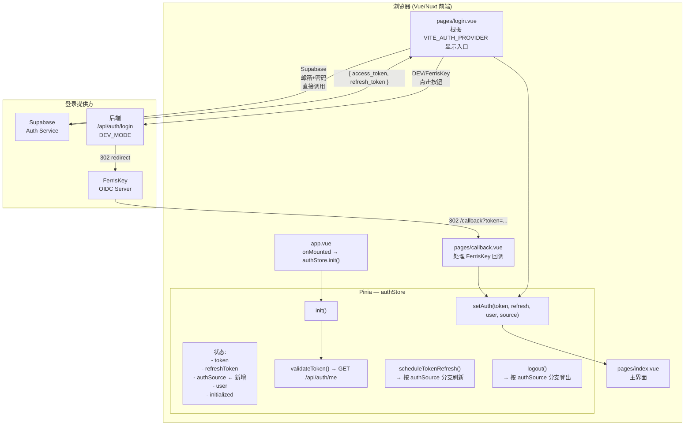

### 3.2 后端视角

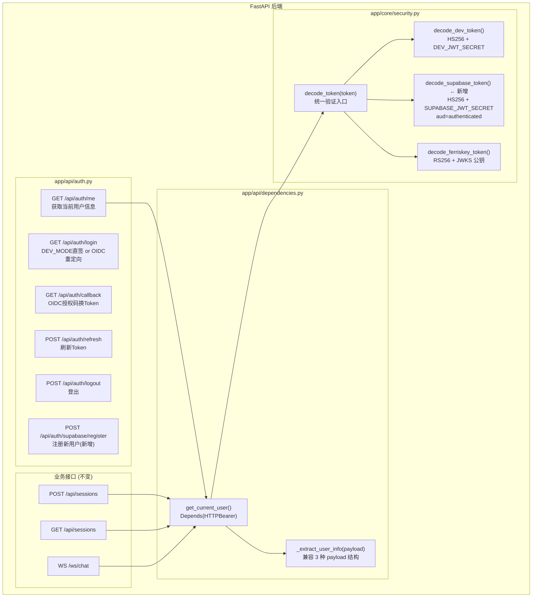

---

## 4. 登录流程详解

### 4.1 DEV_MODE 测试登录流程

> **适用场景**：开发环境，`DEV_MODE=true`，跳过所有外部 IAM

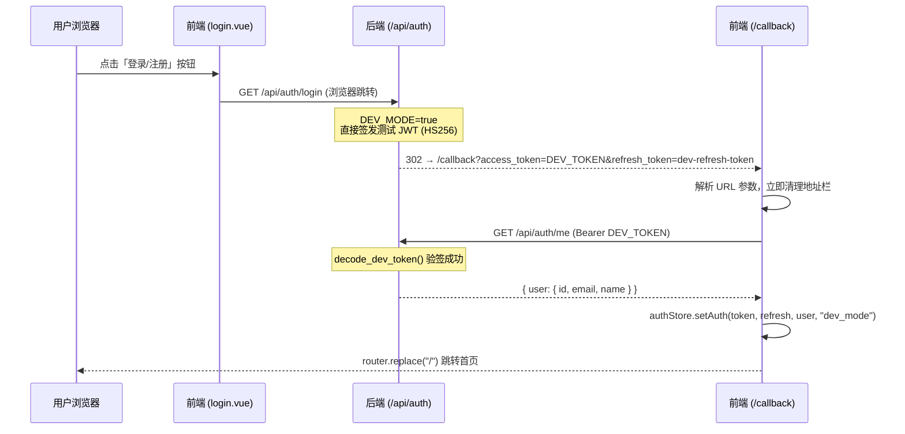

### 4.2 FerrisKey OIDC 登录流程

> **适用场景**：生产环境内部使用，`DEV_MODE=false`，FerrisKey 配置完整

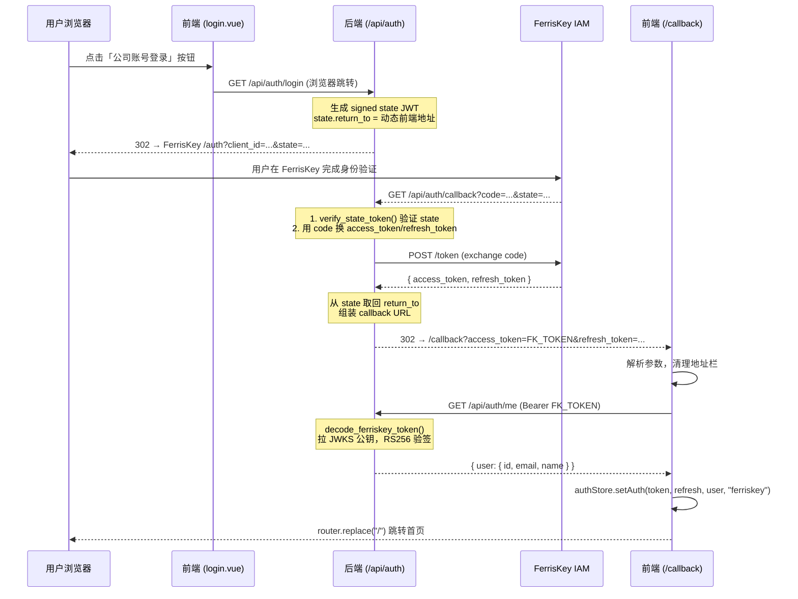

**关键机制：动态 callback URL 解析**

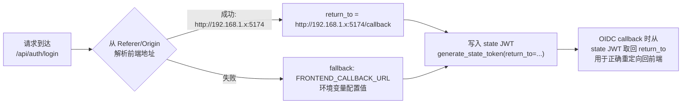

> 此机制解决了局域网多 IP 访问时回调地址不匹配的问题

### 4.3 Supabase 邮箱密码登录流程

> **适用场景**：生产环境甲方交付，`DEV_MODE=false`，`SUPABASE_AUTH_ENABLED=true`

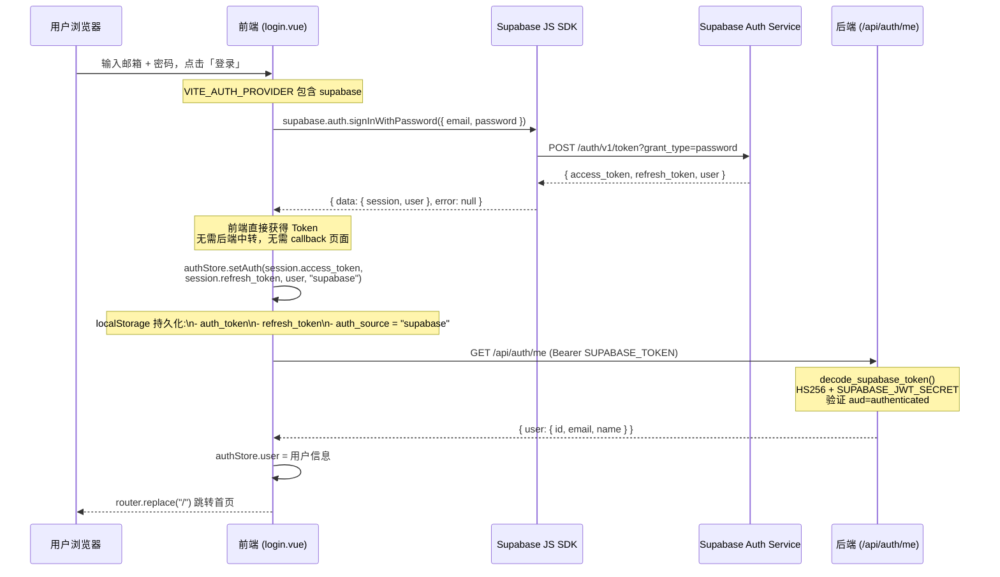

**Supabase 注册流程**

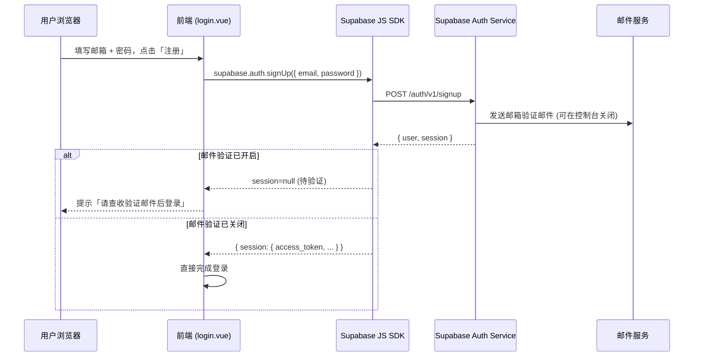

---

## 5. 前端入口控制设计

### 5.1 控制变量

| 变量名 | 位置 | 说明 |
|---|---|---|
| `VITE_AUTH_PROVIDER` | `frontend/.env` | 控制登录页显示的入口类型 |

| `VITE_AUTH_PROVIDER` 值 | 显示效果 |
|---|---|
| `ferriskey` | 只显示 FerrisKey 统一登录按钮，不显示邮箱表单 |
| `supabase` | 只显示邮箱/密码表单，不显示 FerrisKey 按钮 |
| `both` | 两套入口同时显示，中间用分割线隔开 |
| 不填 / 其他 | 默认等同于 `both` |

### 5.2 登录页 UI 布局设计

```
┌────────────────────────────────────────────────────────────┐
│  左侧品牌区 (55%)          │  右侧登录区 (45%)             │
│  (保持不变)                 │                               │
│                            │  ┌─────────────────────────┐  │
│                            │  │  欢迎使用                │  │
│                            │  │  Alalloy Agent           │  │
│                            │  └─────────────────────────┘  │
│                            │                               │
│                            │  ╔══════════════════════════╗ │
│                            │  ║ [当 ferriskey 或 both]   ║ │
│                            │  ║                          ║ │
│                            │  ║  🏢 使用公司账号登录     ║ │
│                            │  ║  TopMaterial 统一认证中心 ║ │
│                            │  ║  [ 🔑 FerrisKey 登录 ]   ║ │
│                            │  ╚══════════════════════════╝ │
│                            │                               │
│                            │  [当 both 时显示]             │
│                            │  ─────────── 或 ───────────   │
│                            │                               │
│                            │  ╔══════════════════════════╗ │
│                            │  ║ [当 supabase 或 both]    ║ │
│                            │  ║                          ║ │
│                            │  ║  📧 使用邮箱账号登录     ║ │
│                            │  ║  ┌────────────────────┐  ║ │
│                            │  ║  │ 邮箱地址            │  ║ │
│                            │  ║  └────────────────────┘  ║ │
│                            │  ║  ┌────────────────────┐  ║ │
│                            │  ║  │ 密码                │  ║ │
│                            │  ║  └────────────────────┘  ║ │
│                            │  ║  [ 登录 ]  [ 注册 ]      ║ │
│                            │  ╚══════════════════════════╝ │
│                            │                               │
└────────────────────────────────────────────────────────────┘
```

### 5.3 各部署场景配置对照

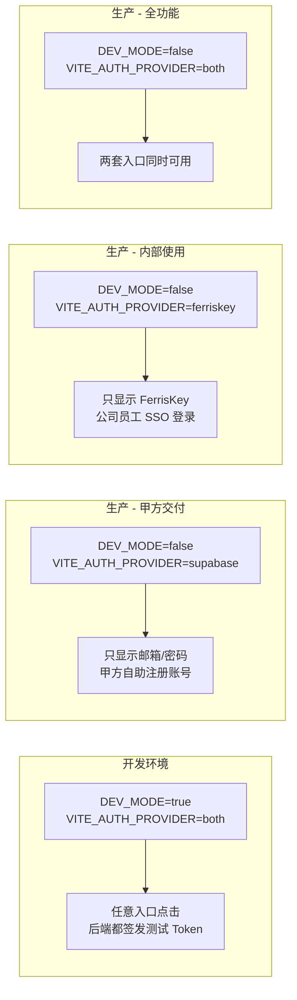

---

## 6. Token 统一验证链设计

### 6.1 `decode_token()` 验证流程

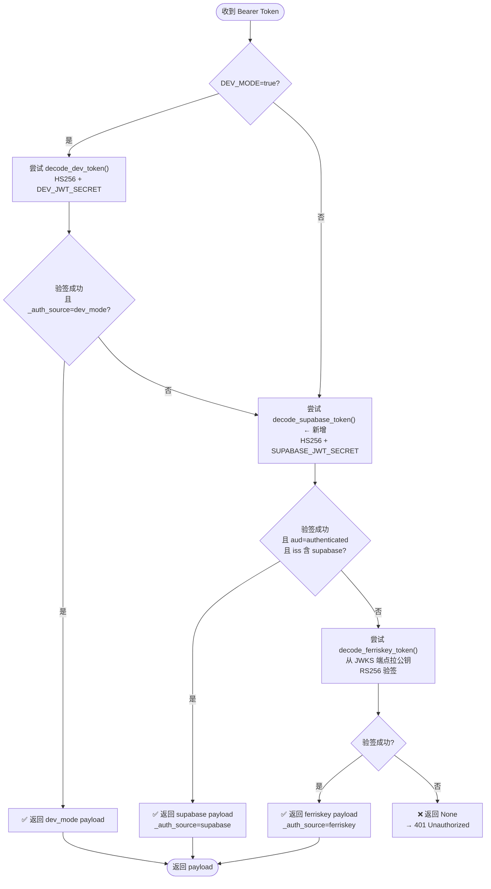

### 6.2 三种 JWT 的关键特征对比

| 特征字段 | DEV_MODE Token | FerrisKey Token | Supabase Token |
|---|---|---|---|
| **签名算法** | HS256 | RS256 | HS256 |
| **签名密钥** | `DEV_JWT_SECRET` | FerrisKey JWKS 公钥 | `SUPABASE_JWT_SECRET` |
| **`iss` 字段** | 无 / 任意 | `https://ferriskey-api.topmatdev.com/...` | `https://xxxx.supabase.co/auth/v1` |
| **`aud` 字段** | 无 | 无 | `"authenticated"` |
| **`sub` 格式** | `"dev-user-0001"` | UUID (FerrisKey 内部) | UUID (Supabase Auth) |
| **`email` 位置** | 顶层 `payload.email` | 顶层 `payload.email` | 顶层 `payload.email` |
| **`name` 位置** | 顶层 `payload.name` | 顶层 `payload.preferred_username` | `payload.user_metadata.full_name` |
| **识别标记** | `_auth_source=dev_mode` | `_auth_source=ferriskey` | `_auth_source=supabase` |

### 6.3 验证优先级说明

```
优先级顺序: DEV_MODE → Supabase → FerrisKey

原因:
  1. DEV_MODE 最优先: 开发环境下排除外网依赖，快速验签
  2. Supabase 次之: 本地 HMAC 验签，无网络请求，速度快
  3. FerrisKey 最后: 需要从 JWKS 端点拉公钥（有缓存），有少量网络开销
```

---

## 7. 用户信息统一模型

### 7.1 `_extract_user_info()` 输出格式

无论哪种登录方式，后端业务层看到的用户信息**结构完全一致**：

```python
{
    "id":           str,   # 用户唯一标识 (JWT sub 字段)
    "email":        str,   # 邮箱地址
    "username":     str,   # 用户名/显示名
    "name":         str,   # 全名
    "role":         str,   # 角色 (authenticated / admin / ...)
    "_auth_source": str,   # 来源标记 (dev_mode / ferriskey / supabase)
}
```

### 7.2 各来源字段映射

| 统一字段 | DEV_MODE 来源 | FerrisKey 来源 | Supabase 来源 |
|---|---|---|---|
| `id` | `payload.sub` | `payload.sub` | `payload.sub` |
| `email` | `payload.email` | `payload.email` | `payload.email` |
| `username` | `payload.name` | `payload.preferred_username` | `payload.user_metadata.username` 或 `email` |
| `name` | `payload.name` | `payload.name` | `payload.user_metadata.full_name` 或 `name` |
| `role` | `payload.role` (`"admin"`) | `payload.role` | `payload.role` (`"authenticated"`) |
| `_auth_source` | `"dev_mode"` | `"ferriskey"` | `"supabase"` |

### 7.3 用户 ID 隔离分析

```
FerrisKey 用户 sub: "3fa85f64-5717-4562-b3fc-2c963f66afa6"  ← FerrisKey 内部 UUID
Supabase 用户 sub:  "d7a1c2e3-8f9b-4a5d-b6c7-1e2f3a4b5c6d"  ← Supabase Auth UUID
DEV_MODE 用户 sub:  "dev-user-0001"                          ← 固定测试 ID

→ 三者格式不同或 UUID 来源不同，在 sessions 表中天然隔离
→ 无需额外 user_source 字段，数据库结构不变
```

---

## 8. Token 刷新与登出策略

### 8.1 Token 刷新流程

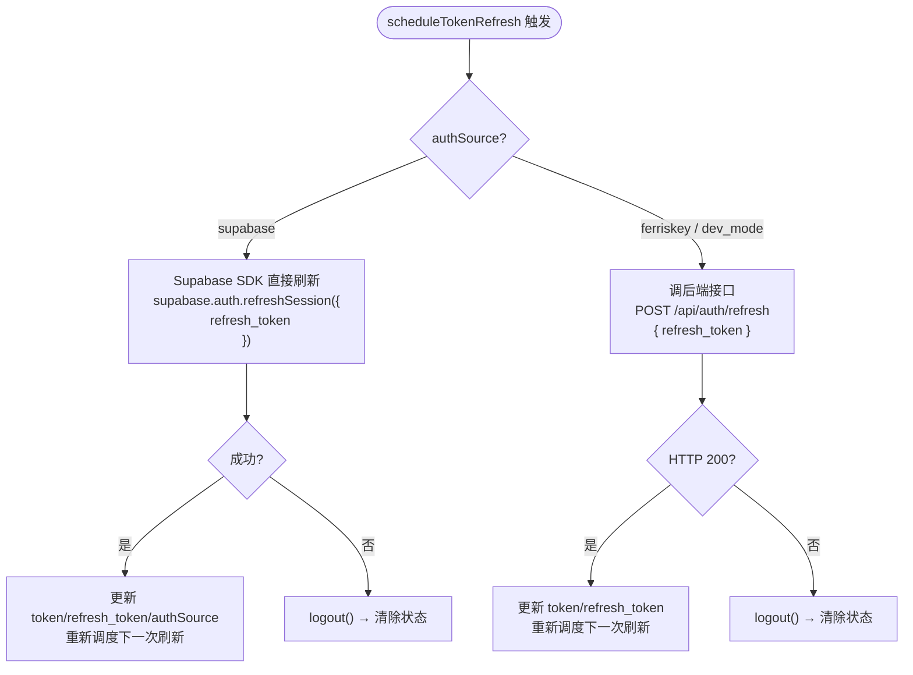

### 8.2 刷新时机策略

| 场景 | 策略 |
|---|---|
| JWT 含 `exp` 字段 | 解析 `exp`，在过期前 **60 秒** 自动刷新 |
| JWT 无 `exp` 或解析失败 | 回退到 **4 分钟** 定时轮询 |
| 刷新失败 | 调用 `logout()` 清除状态，前端路由守卫跳转 `/login` |

### 8.3 登出流程

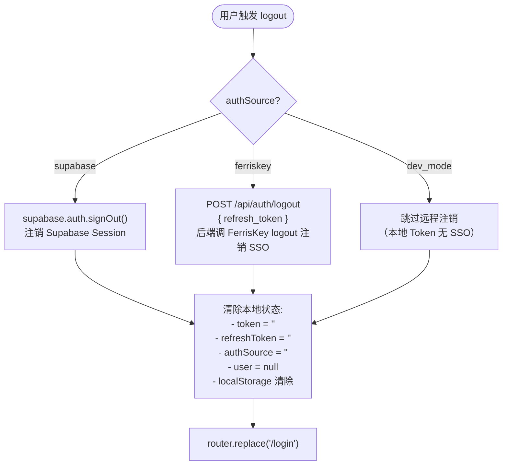

---

## 9. 环境变量配置规范

### 9.1 后端 `.env` — 新增变量

| 变量名 | 类型 | 默认值 | 说明 |
|---|---|---|---|
| `SUPABASE_AUTH_ENABLED` | `bool` | `true` | 是否启用 Supabase Token 验证链，`false` 可关闭 |

> **注意**：以下变量已存在于 `.env`，无需新增：
> - `SUPABASE_URL` ✅
> - `SUPABASE_JWT_SECRET` ✅
> - `SUPABASE_SERVICE_KEY` ✅
> - `SUPABASE_ANON_KEY` ✅

### 9.2 前端 `.env` — 新增变量

| 变量名 | 类型 | 默认值 | 说明 |
|---|---|---|---|
| `VITE_AUTH_PROVIDER` | `string` | `both` | 登录入口显示控制：`ferriskey` / `supabase` / `both` |

> **注意**：以下变量已存在于前端 `.env`，确认前缀即可：
> - `SUPABASE_URL` → 改名为 `VITE_SUPABASE_URL`（Nuxt 公共变量规范）
> - `SUPABASE_ANON_KEY` → 改名为 `VITE_SUPABASE_ANON_KEY`

### 9.3 各部署环境配置速查

#### 开发环境 (`.env.development` 或 `.env`)
```ini
# 后端
DEV_MODE=true
SUPABASE_AUTH_ENABLED=true
SUPABASE_JWT_SECRET=xuIoInSYrFQlRzv4o8OTGaHV/...（已有）

# 前端
VITE_DEV_MODE=true
VITE_AUTH_PROVIDER=both
VITE_SUPABASE_URL=https://fyonyyermialezvlvamv.supabase.co
VITE_SUPABASE_ANON_KEY=eyJhbGci...（已有）
```

#### 生产 — 甲方交付 (`.env.production.client`)
```ini
# 后端
DEV_MODE=false
FERRISKEY_CLIENT_SECRET=（可留空，不需要）
SUPABASE_AUTH_ENABLED=true
SUPABASE_JWT_SECRET=xuIoInSYrFQlRzv4o8OTGaHV/...（已有）

# 前端
VITE_AUTH_PROVIDER=supabase
VITE_SUPABASE_URL=https://fyonyyermialezvlvamv.supabase.co
VITE_SUPABASE_ANON_KEY=eyJhbGci...（已有）
```

#### 生产 — 公司内部 (`.env.production.internal`)
```ini
# 后端
DEV_MODE=false
FERRISKEY_CLIENT_SECRET=（必须配置）
SUPABASE_AUTH_ENABLED=false   # 关闭 Supabase 入口

# 前端
VITE_AUTH_PROVIDER=ferriskey
```

#### 生产 — 全功能双入口 (`.env.production`)
```ini
# 后端
DEV_MODE=false
FERRISKEY_CLIENT_SECRET=（必须配置）
SUPABASE_AUTH_ENABLED=true
SUPABASE_JWT_SECRET=xuIoInSYrFQlRzv4o8OTGaHV/...

# 前端
VITE_AUTH_PROVIDER=both
VITE_SUPABASE_URL=https://fyonyyermialezvlvamv.supabase.co
VITE_SUPABASE_ANON_KEY=eyJhbGci...
```

---

## 10. 文件变更清单

### 10.1 后端变更

| 文件 | 变更类型 | 变更内容摘要 |
|---|---|---|
| `backend/app/core/security.py` | **修改** | ① 新增 `SUPABASE_AUTH_ENABLED` 配置读取；② 新增 `decode_supabase_token()` 函数；③ 在 `decode_token()` 中添加 Supabase 验证分支（优先级第 2） |
| `backend/app/api/dependencies.py` | **修改** | `_extract_user_info()` 按 `_auth_source` 分支提取字段，新增 Supabase payload 路径 |
| `backend/app/api/auth.py` | **修改** | ① `POST /api/auth/refresh` 中新增 Supabase refresh token 代理分支；② 新增 `POST /api/auth/supabase/register` 注册端点（可选） |
| `backend/.env` | **新增配置** | 新增 `SUPABASE_AUTH_ENABLED=true` |

### 10.2 前端变更

| 文件 | 变更类型 | 变更内容摘要 |
|---|---|---|
| `frontend/app/stores/auth.js` | **修改** | ① 新增 `authSource` 状态字段及 localStorage 持久化；② `setAuth()` 增加 `source` 参数；③ `_performRefresh()` 按 `authSource` 分支刷新；④ `logout()` 按 `authSource` 分支登出 |
| `frontend/app/pages/login.vue` | **修改** | ① 引入 Supabase JS SDK；② 新增邮箱/密码表单组件；③ 按 `VITE_AUTH_PROVIDER` 控制各区块的 `v-if` 显示 |
| `frontend/.env` | **修改** | ① 新增 `VITE_AUTH_PROVIDER=both`；② `SUPABASE_URL` 改名为 `VITE_SUPABASE_URL`；③ `SUPABASE_ANON_KEY` 改名为 `VITE_SUPABASE_ANON_KEY` |
| `frontend/package.json` | **修改** | 新增依赖 `@supabase/supabase-js` |

### 10.3 不需要修改的文件

| 文件 | 原因 |
|---|---|
| `frontend/app/pages/callback.vue` | 仅处理 FerrisKey 回调，Supabase 不走此页面，无需修改 |
| `frontend/app/pages/index.vue` | 消费 `authStore.token`，来源无关，无需修改 |
| `frontend/app/composables/useMultiAgent.js` | WebSocket 连接只用 `authStore.token`，来源无关 |
| `frontend/app/composables/useSessions.js` | REST API 调用只用 `authStore.token`，来源无关 |
| `backend/app/api/rest.py` | 业务接口通过 `Depends(get_current_user)` 获取用户，来源无关 |
| `backend/app/api/websocket/routes.py` | WebSocket 鉴权调用 `extract_user_from_token_sync()`，已由 `decode_token_sync()` 统一处理 |
| 数据库 Schema | `sessions` 表 `user_id` 直接存 JWT `sub`，不同来源 `sub` 天然不冲突 |

---

## 11. 数据库影响分析

### 11.1 Sessions 表现状

```sql
CREATE TABLE sessions (
    id         UUID PRIMARY KEY,
    title      TEXT,
    status     TEXT,
    user_id    TEXT,   -- 存储 JWT sub 字段
    metadata   JSONB,
    created_at TIMESTAMPTZ,
    updated_at TIMESTAMPTZ
);
```

### 11.2 多来源用户数据隔离

```
FerrisKey 用户 A:
  user_id = "3fa85f64-5717-4562-b3fc-2c963f66afa6"  (FerrisKey UUID)
  sessions: [s1, s2, s3]

Supabase 用户 B:
  user_id = "d7a1c2e3-8f9b-4a5d-b6c7-1e2f3a4b5c6d"  (Supabase Auth UUID)
  sessions: [s4, s5]

DEV_MODE 用户:
  user_id = "dev-user-0001"
  sessions: [s6]

→ 三者 user_id 值不同，数据库查询 .eq("user_id", user_id) 天然隔离
→ 无需修改 Schema，无需新增 auth_source 列
```

### 11.3 Supabase RLS（行级安全）

Supabase 数据库已启用 Row Level Security，通过 Service Key 绕过 RLS 进行服务器端操作，**现有策略无需修改**：

```sql
-- 后端使用 Service Key，绕过 RLS，在应用层做 user_id 过滤
-- 这是现有设计，兼容所有登录来源
```

---

## 12. 安全注意事项

### 12.1 密钥安全

| 密钥 | 存放位置 | 危险等级 | 说明 |
|---|---|---|---|
| `SUPABASE_JWT_SECRET` | 仅后端 `.env` | 🔴 极高 | 泄露可伪造任意用户 Token |
| `SUPABASE_SERVICE_KEY` | 仅后端 `.env` | 🔴 极高 | 拥有数据库超级权限 |
| `FERRISKEY_CLIENT_SECRET` | 仅后端 `.env` | 🔴 极高 | 泄露可代表应用发起 OIDC |
| `DEV_JWT_SECRET` | 后端 `.env` | 🟠 高 | 生产环境必须修改默认值 |
| `VITE_SUPABASE_ANON_KEY` | 前端 `.env`，打包进 JS | 🟡 中 | 公开设计，权限受 RLS 限制 |
| `VITE_SUPABASE_URL` | 前端 `.env`，打包进 JS | 🟢 低 | 项目端点，公开可见 |

### 12.2 关键安全规则

```
✅ SUPABASE_JWT_SECRET 绝对不能有 VITE_ 前缀
   → 有 VITE_ 前缀的变量会被打包进前端 JS，所有用户可见

✅ Supabase Token 识别必须同时验证多个字段
   → 仅验证 HMAC 签名不够，还需检查:
      - iss 字段包含 "supabase"
      - aud 字段 == "authenticated"
   → 防止 DEV_MODE Token 被误识别为 Supabase Token

✅ OIDC State 使用 JWT 签名防 CSRF（现有机制，保持不变）

✅ callback.vue 立即用 history.replaceState 清除 URL 中的 Token（现有机制，保持不变）

✅ Supabase 邮件验证
   → 生产环境建议开启（Supabase Dashboard → Auth → Email Verification）
   → 甲方交付场景可按需关闭（Supabase Dashboard → Auth → 关闭 Confirm Email）

✅ 生产环境必须修改 DEV_JWT_SECRET 默认值
   → 当前默认: "alalloy-dev-secret-change-in-production"（已提示）
```

### 12.3 Supabase Token 识别歧义防御

```python
# 错误做法（仅验签，不检查来源）
def decode_supabase_token_WRONG(token):
    payload = jwt.decode(token, SUPABASE_JWT_SECRET, ...)
    return payload  # 可能误判其他 HS256 token

# 正确做法（严格检查 iss 和 aud）
def decode_supabase_token(token):
    payload = jwt.decode(token, SUPABASE_JWT_SECRET, ...)
    iss = payload.get("iss", "")
    aud = payload.get("aud", "")
    # 必须同时满足两个条件
    if "supabase" not in iss or aud != "authenticated":
        return None  # 不是 Supabase Token
    return payload
```

---

## 13. 实施计划

### 13.1 阶段划分

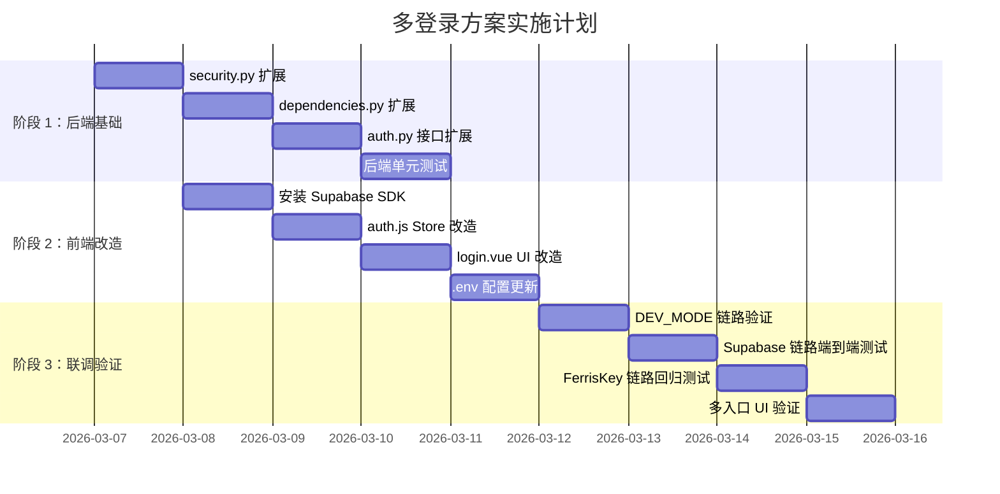

### 13.2 步骤详细说明（已修订）

> ⚠️ **Step 1b 是关键前置步骤**：漏掉会导致 Supabase 用户 WebSocket 连接被 4003 拒绝，聊天功能完全不可用。

| 步骤 | 文件 | 操作 | 验证方法 |
|---|---|---|---|
| **Step 1a** | `security.py` | 新增 `decode_supabase_token()`（HS256 同步），扩展 `decode_token()`（异步入口） | curl `/api/auth/me` 用 Supabase Token 返回 200 |
| **Step 1b** ⚠️ | `security.py` | **扩展 `decode_token_sync()`**：在 FerrisKey 分支前插入 Supabase HS256 验证 | Supabase 用户 WebSocket /ws/chat 连接成功 |
| **Step 2** | `dependencies.py` | `_extract_user_info()` 新增 supabase 分支，解析 `user_metadata.full_name` | `/api/auth/me` 正确返回 `name` 字段 |
| **Step 3** | `auth.py` | `/refresh` 扩展 Supabase 分支；`/logout` 新增 `source` 字段；新增 `/supabase/register` | curl 测试各接口 |
| **Step 4** | `package.json` | `npm install @supabase/supabase-js` | `npm list @supabase/supabase-js` |
| **Step 5** | `nuxt.config.ts` | `runtimeConfig.public` 新增 `authProvider`、`supabaseUrl`、`supabaseAnonKey` | `useRuntimeConfig().public.authProvider` 可读 |
| **Step 6** | `frontend/.env` | 新增 `NUXT_PUBLIC_AUTH_PROVIDER`、`NUXT_PUBLIC_SUPABASE_URL`、`NUXT_PUBLIC_SUPABASE_ANON_KEY`（使用 `NUXT_PUBLIC_` 前缀，非 `VITE_`，运行时可覆盖无需重新打包） | 修改值后重启进程生效 |
| **Step 7** | `config/index.js` | 导出 `AUTH_PROVIDER`、`SUPABASE_URL`、`SUPABASE_ANON_KEY` | `CONFIG.AUTH_PROVIDER` 可读 |
| **Step 8** | `auth.js` | 新增 `authSource` 状态（持久化 `auth_source`），分支 refresh/logout，新增 `loginWithSupabase`/`registerWithSupabase` | localStorage 出现 `auth_source=supabase` |
| **Step 9** | `login.vue` | 邮箱/密码表单，按 `AUTH_PROVIDER` 控制 `v-if` | 切换 env 变量重启，UI 入口正确显示/隐藏 |
| **Step 10** | 全链路 | 三条登录链路端到端测试，验证 WebSocket/REST/刷新/登出 | Network 面板检查所有请求 |

### 13.3 关键遗漏补充：`decode_token_sync()` 修正

```python
# WebSocket 鉴权使用同步验证，Supabase HS256 可同步执行，需显式添加
def decode_token_sync(token: str) -> Optional[dict]:
    if DEV_MODE:
        return decode_dev_token(token)

    # ★ 新增：Supabase HS256 — 纯本地运算，同步上下文安全，无需网络
    supabase_payload = decode_supabase_token(token)
    if supabase_payload:
        return supabase_payload

    # FerrisKey RS256 — 依赖已有 JWKS 缓存（现有逻辑）
    global _jwks_cache
    if not _jwks_cache:
        return None
    # ... 后续不变
```

### 13.4 关键遗漏补充：`logout()` 来源区分

Supabase refresh_token 若误发给 FerrisKey 会产生静默错误且 Supabase Server Session 不注销。`LogoutRequest` 增加 `source` 字段：前端 Supabase 用户通过 SDK `supabase.auth.signOut()` 直接注销，并传 `source="supabase"` 让后端跳过 FerrisKey 调用。

### 13.5 环境变量前缀修正

| 前缀 | 类型 | 修改后需重新打包 | 使用场景 |
|---|---|---|---|
| `VITE_` | 构建时注入（嵌入 JS 产物） | ✅ 需要 | 现有端口/Host 等 |
| `NUXT_PUBLIC_` | 运行时（覆盖 runtimeConfig.public） | ❌ 不需要，重启即可 | 新增 authProvider、Supabase 配置 |

### 13.6 回滚方案

```ini
# 后端
SUPABASE_AUTH_ENABLED=false       # 关闭 Supabase Token 验证链

# 前端
NUXT_PUBLIC_AUTH_PROVIDER=ferriskey  # 隐藏 Supabase 入口，重启进程即生效
```

两个变量修改后重启服务即可，**无需代码回滚，无需数据库操作**。

---

## 附录 A：Supabase JWT Payload 示例

```json
{
  "iss": "https://fyonyyermialezvlvamv.supabase.co/auth/v1",
  "sub": "d7a1c2e3-8f9b-4a5d-b6c7-1e2f3a4b5c6d",
  "aud": "authenticated",
  "exp": 1741968000,
  "iat": 1741964400,
  "email": "client_user@example.com",
  "phone": "",
  "role": "authenticated",
  "aal": "aal1",
  "session_id": "abc123-...",
  "is_anonymous": false,
  "app_metadata": {
    "provider": "email",
    "providers": ["email"]
  },
  "user_metadata": {
    "email": "client_user@example.com",
    "full_name": "甲方用户",
    "email_verified": true
  },
  "amr": [
    { "method": "password", "timestamp": 1741964400 }
  ]
}
```

## 附录 B：FerrisKey JWT Payload 示例

```json
{
  "iss": "https://ferriskey-api.topmatdev.com/realms/topmat-public",
  "sub": "3fa85f64-5717-4562-b3fc-2c963f66afa6",
  "exp": 1741968000,
  "iat": 1741964400,
  "email": "employee@topmaterial-tech.com",
  "preferred_username": "zhangsan",
  "name": "张三",
  "role": "authenticated",
  "_auth_source": "ferriskey"
}
```

## 附录 C：统一用户信息输出示例

```python
# Supabase 用户经 _extract_user_info() 处理后
{
    "id":           "d7a1c2e3-8f9b-4a5d-b6c7-1e2f3a4b5c6d",
    "email":        "client_user@example.com",
    "username":     "client_user@example.com",
    "name":         "甲方用户",
    "role":         "authenticated",
    "_auth_source": "supabase"
}

# FerrisKey 用户经 _extract_user_info() 处理后
{
    "id":           "3fa85f64-5717-4562-b3fc-2c963f66afa6",
    "email":        "employee@topmaterial-tech.com",
    "username":     "zhangsan",
    "name":         "张三",
    "role":         "authenticated",
    "_auth_source": "ferriskey"
}

# 两者对 rest.py 业务代码完全透明，current_user["id"] 使用方式一致
```

---

*文档结束 — Alalloy Agent 多登录方案 v1.0*
